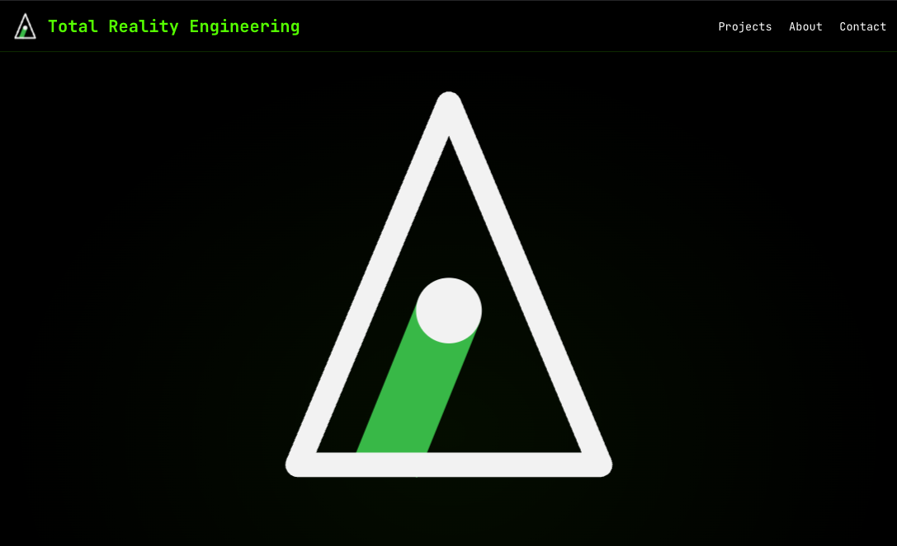

# Total Reality Engineering Website

A minimal, elegant portfolio website showcasing GitHub projects with a terminal-inspired design.



## 🚀 Quick Start

```bash
# Serve locally
npx serve .

# Update projects from GitHub, including private TRE cards
PROJECTS_GITHUB_TOKEN="$(gh auth token)" npm run build
```

Open [http://localhost:3000](http://localhost:3000) in your browser.

## 📁 Structure

```
├── index.html                              # Main page
├── styles.css                              # All styling
├── script.js                               # Animations & interactions
├── build-projects.js                       # GitHub project fetcher
├── package.json                            # Scripts & config
├── favicon.svg                             # Site icon
├── logo192.png                             # Apple touch icon
└── .github/workflows/update-static-site.yml # Daily auto-update
```

## 🔄 Updating Projects

Projects are fetched from GitHub and injected into `index.html`. This happens:
- **Automatically**: Daily via GitHub Actions
- **Manually**: Run `node build-projects.js`

To include private TRE repos that have a public TRE-owned homepage, run the
build with a token that can read those repositories:
```bash
PROJECTS_GITHUB_TOKEN="$(gh auth token)" npm run build
```

The script also accepts `GITHUB_TOKEN`, but `PROJECTS_GITHUB_TOKEN` is the
preferred name because it matches the scheduled workflow secret. Running
`npm run build` without a private-repo token regenerates a public-only project
grid locally.

In GitHub Actions, set `PROJECTS_GITHUB_TOKEN` to a token that can read the
private `tre-systems` repos if private-project cards should be refreshed by
the scheduled workflow. Without that secret, the workflow skips project
regeneration and deploys the committed site.
Private repos are shown only when they have a description, topics, a README
image, and a public TRE-owned homepage; private GitHub links are never rendered.

### Private Repo Project Cards

Private TRE repositories can appear on the public site, but the scheduled
GitHub Actions refresh needs an explicit repository secret named
`PROJECTS_GITHUB_TOKEN`. Use a GitHub token that can read the relevant private
`tre-systems` repositories, including README and image files. A fine-grained
token should have read-only contents access for the private repositories that
may be displayed; a classic token needs equivalent private-repo read access.

If `PROJECTS_GITHUB_TOKEN` is missing or invalid, the workflow deliberately
skips `node build-projects.js` and deploys the already committed `index.html`
and `generated/project-images` files. That keeps existing private cards live,
but they will not update automatically until the secret is configured.

## 🎨 Design

- **Colors**: Black background (#000), Terminal green (#39FF14), White text
- **Fonts**: Inter (body), JetBrains Mono (headings/code)
- **Animations**: CSS keyframes for glow, fade-in, slide-up effects

## 📄 License

MIT License

## 👨‍💻 Author

**Robert Gilks** - [LinkedIn](https://www.linkedin.com/in/rob-gilks-39bb03/) | [GitHub](https://github.com/rgilks)

Total Reality Engineering • Founded Australia 1998 • UK 2008
